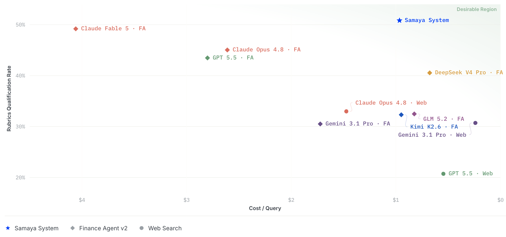

<p align="center">
  <a href="https://research.samaya.ai/benchmarks/frontier-finance">
    
  </a>
</p>

<h1 align="center">Samaya AI's FrontierFinance Benchmark Grader</h1>

<p align="center">
  <a href="https://research.samaya.ai/benchmarks/frontier-finance"></a>
  <a href="https://huggingface.co/datasets/samaya-ai/FrontierFinance"></a>
</p>

Rubrics-based LLM grader for Samaya AI's FrontierFinance benchmark.
Given a set of **rubrics** per query and the **system responses** you want to grade, 
an LLM judge panel decides whether each rubric is satisfied, and the tool reports 
qualification-rate metrics.

It is self-contained: it talks to provider APIs through their official SDKs and
has no dependency on any internal evaluation framework.



## Install

The judge backends are optional extras ("flavors") — install only the providers
you'll use:

```bash
uv pip install 'frontier-finance[anthropic]'          # Claude judges (default)
uv pip install 'frontier-finance[openai,gemini]'      # mix and match
uv pip install 'frontier-finance[all]'                # all three backends
```

Extras: `anthropic` (claude-* models), `openai` (gpt-* / o* models), `gemini`
(gemini-* models), `all`. The core install pulls in only PyYAML; configuring a
judge model whose backend isn't installed raises an error telling you which
flavor to add.

For local development on this package:

```bash
uv sync --extra dev   # installs all backends + pytest
```

## Get the data

The Hugging Face dataset ships the **rubrics** (`frontier_finance_public.jsonl`);
you bring your own system responses to grade against them. Download the rubrics
into the current directory with:

```bash
./scripts/download_data.sh          # -> ./frontier_finance_public.jsonl
./scripts/download_data.sh some/dir # or into a directory of your choice
```

The dataset is public — no login or token needed. The script uses the `hf` CLI
when available and otherwise falls back to `curl`.

## Run

### Step 1 — Export the API key(s) for your judge models

Set the key for whichever judge models your config uses:

```bash
export ANTHROPIC_API_KEY=...   # claude-* judges (default)
export OPENAI_API_KEY=...      # gpt-* / o* judges
export GEMINI_API_KEY=...      # gemini-* judges
```

### Step 2 — Write your run config

Create a YAML config pointing at your rubrics and responses. See
[`eval.example.yaml`](eval.example.yaml) — the exact config we used to produce
our reported numbers — and adjust the paths, `judge_models`, and knobs as needed:

```yaml
rubrics_path: frontier_finance_public.jsonl   # from ./scripts/download_data.sh
responses_path: system_summaries.json         # your own system responses
output_dir: grader_results/

judge_models:
  - claude-sonnet-4-6
  - gemini-3.1-pro-preview
  - gpt-5.4

max_rubrics_per_call: 30   # rubrics per LLM call
concurrency: 8             # queries graded in parallel
max_tokens: 64000          # max output tokens per judge call
```

### Step 3 — Run the grader

```bash
uv run frontier-finance-grader --config eval.example.yaml
```

Writes `metrics.json` and `per_item.json` to the config's `output_dir` and logs
a metrics table.

## Input formats

**Rubrics JSONL** — what you get from `download_data.sh`, for reference; one query
per line:

```json
{
  "query_id": "85bc71fb95e1a5c4",
  "query": "What are Databricks' main competitors?",
  "query_date": "2024-10-31",
  "rubrics": [
    {
      "rubric_id": 1,
      "rubric_text": "Indicates that Databricks is a private company...",
      "must_have": false,
      "rubric_type": "Qualitative & Contextual Information",
      "data_source_type": "company_originated_content"
    }
  ]
}
```

**Responses JSON** — the responses from your own system, as a JSON array; each
`query_id` must match a rubrics line:

```json
[{"query_id": "85bc71fb95e1a5c4", "system_summary": "Databricks competes with..."}]
```

## How judging works

For each query, the rubrics are sent to each judge model (in batches of
`max_rubrics_per_call`) with the query, its date, and the response. The judge
returns a per-rubric boolean. With multiple `judge_models`, each rubric is
decided by **majority vote** (the first model breaks ties). Use an **odd** panel
so a majority always exists — a tie is only possible with an even number of
surviving votes.

**Judge failures.** A judge that errors (or returns unparseable JSON through all
retries) is dropped from the vote, and the rubric checks it skipped are counted
against it in `failed_criteria_checks_by_judge`. As long as at least one judge
survives, the query is still graded on the surviving votes — a partial judge
failure is *not* a failed query. When **every** judge fails on a present response
(`failure_reason: "judge_error"`), that's a grader-side failure, not the
system's, so the query is **excluded from every scored metric** (`num_records`
and all denominators) — equivalent to skipping it — and only reported via
`num_judge_errors` and the per-judge stats. A query with no response
(`failure_reason: "no_response"`) is a system failure and *does* count as failed.

## Metrics

A rubric is *qualified* when the response satisfies it. *Macro* averages mean
per-query rates; *micro* averages total qualified / total rubrics. *Success*
queries are those that were graded; *failed* queries contribute 0 qualified and
their full rubric count toward the "all queries" denominators. *must_have* is the
essential rubric subset.

`metrics.json` includes:

- `num_records` (excludes judge errors), `num_failed_queries` (no-response failures), `num_judge_errors`, `num_rubrics_on_success_queries`, `num_rubrics_on_all_queries`, `num_qualified_rubrics`
- `failed_criteria_checks_by_judge` — per judge model, how many rubric checks it failed to produce across the run
- `macro_avg_qualification_rate_on_success_queries`, `micro_…`
- `…_on_all_queries`
- `…_must_have_…` variants of all four
- `breakdown_by_rubric_type`, `breakdown_by_data_source_type` (micro rate per taxonomy value, over success queries)

`per_item.json` has the per-rubric judge decisions for each query, plus each
query's `failure_reason` and `failed_checks_by_judge`.

## Unit Tests (No API keys needed)

```bash
uv run pytest
```

## Citation

If you use FrontierFinance dataset or this grading code, please cite as the following:
```
@article{zhang2026frontierfinance,
  title   = {FrontierFinance: A Benchmark for Measuring Frontier Intelligence of Finance Agents},
  author  = {Zhang, Yuhao and Koyluoglu, Ozan and Venkatesh, Thejas and Diehl Martinez, Richard and Bhatia, Vishank and Alidoust, Arash and Paranjape, Ashwin},
  year    = {2026}
}
```
